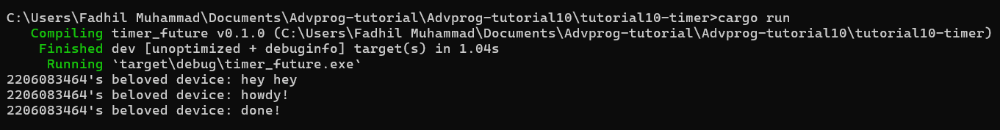

# Reflections

## 1.2 Understanding How it Works

Dalam kode ini, sebuah executor dan spawner baru dibuat menggunakan fungsi `new_executor_and_spawner()`. Kemudian, sebuah task di-spawn secara asynchronous menggunakan konstruksi `spawner.spawn(async { ... })`. Task ini mencetak "2206083464's beloved device: howdy!", menunggu selama dua detik menggunakan `TimerFuture::new(Duration::new(2, 0)).await`, dan kemudian mencetak "2206083464's beloved device: done!".

Sementara itu, di luar task yang di-spawn, fungsi main mencetak "2206083464's beloved device: hey hey", menjatuhkan spawner menggunakan `drop(spawner)`, dan kemudian menjalankan executor sampai antrian task kosong menggunakan `executor.run()`.

Hasilnya adalah sebagai berikut:

1. "2206083464's beloved device: hey hey" dicetak pertama karena dieksekusi dalam fungsi main sebelum ada task asynchronous yang di-spawn.
2. "2206083464's beloved device: howdy!" dicetak selanjutnya karena berada di dalam task asynchronous yang di-spawn. Namun, karena ini adalah task asynchronous, itu tidak memblokir eksekusi fungsi main, sehingga fungsi main tetap berlanjut dieksekusi.
3. Setelah dua detik, "2206083464's beloved device: done!" dicetak, menandakan bahwa task asynchronous telah selesai.

Jadi, urutan pernyataan cetak mencerminkan sifat asynchronous dari task yang di-spawn, di mana task tersebut berjalan secara concurrent dengan function main dan tidak memblokir eksekusinya.

## 1.3 Multiple Spawn and removing drop

Dalam kode yang dimodifikasi, tiga task asynchronous di-spawn menggunakan konstruksi `spawner.spawn(async { ... })`. Setiap task mencetak "2206083464's beloved device: howdy!", menunggu selama dua detik menggunakan `TimerFuture::new(Duration::new(2, 0)).await`, dan kemudian mencetak "2206083464's beloved device: done!".

Fungsi utama mencetak "2206083464's beloved device: hey hey" sebelum men-spawn task apa pun.

Karena task-task tersebut asynchronous, mereka berjalan konkuren satu sama lain dan dengan fungsi utama. Ini berarti bahwa ketiga task tersebut dimulai hampir secara bersamaan. Setiap task menunggu selama dua detik secara asynchronous menggunakan `TimerFuture`, sehingga mereka tidak memblokir satu sama lain atau fungsi utama.

Sebagai hasilnya, output menunjukkan "2206083464's beloved device: howdy!" dicetak tiga kali secara cepat berturut-turut, diikuti oleh "2206083464's beloved device: done!" yang dicetak tiga kali setelah setiap task menyelesaikan waktu tunggu dua detiknya. Pesan "2206083464's beloved device: hey hey" dicetak pertama karena dieksekusi dalam fungsi utama sebelum task asynchronous apa pun di-spawn.

Dengan drop:

Tanpa drop:

Ketika kita tidak menambahkan `drop(spawner)`, program tidak akan menunggu tugas-tugas selesai sebelum keluar. Hal ini karena spawner dan tugas-tugas tidak dibersihkan dengan benar ketika mereka tidak lagi diperlukan. Dengan menambahkan baris drop(spawner), kita memastikan bahwa spawner dan tugas-tugas dibersihkan dengan benar ketika mereka tidak lagi diperlukan, yang memungkinkan program untuk menunggu tugas-tugas selesai sebelum keluar.